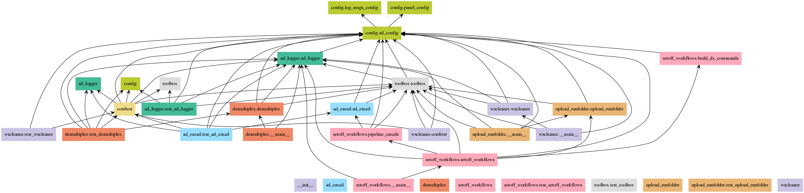
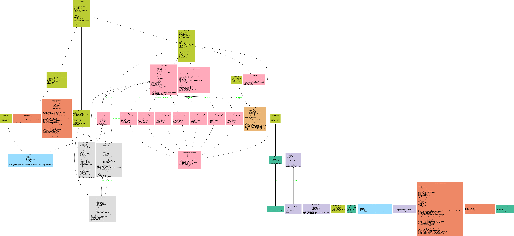

# Automate Demultiplex Scripts

This repository contains the main scripts for routine analysis of clinical next generation sequencing (NGS) data at Viapath Genetics. Follow the links in the below table for specific documentation.

| Script | Run mode | Details |
| ------ | -------- | ------- |
|[demultiplex.py](demultiplex.py) | Command line | Demultiplex (excluding TSO runs) and calculate cluster density for Illumina NGS data using `bcl2fastq2` [(guide)](demultiplex/README.md) |
| [setoff_workflows.py](setoff_workflows.py) | Command line | Upload NGS data to DNAnexus and trigger in-house workflows [(guide)](setoff_workflows/README.md) |
| [congenica_inputs.py](congenica_inputs.py) | Command line |Prints the inputs required by the congenica upload apps in DNAnexus [(guide)](congenica_inputs/README.md). This script is called from the dx run script for samples requiring congenica upload (the dx run script is created by [setoff_workflows.py](setoff_workflows.py)) |
| [upload_runfolder](upload_runfolder) | Command line or module import | Uploads an Illumina runfolder to DNAnexus [(guide)](upload_runfolder/README.md)|

# Assumptions / Requirements

Each runfolder must be discrete per workflow, therefore must consist of only one of the following types:
* TSO500
* ADX
* SNP
* WES
* Custom Panels / LRPCR

The type of run is detected by the scripts by matching the Pan numbers within the sample names in the corresponding samplesheet to the pan numbers in the [panel_config](config/panel_config.py).

# Setup

The script has been tested using python v3.10.6 therefore it is recommended that this version of python is used.

Dependencies, which include the [samplesheet_validator](https://github.com/moka-guys/samplesheet_validator) package**, are installed using the requirements.txt file:

```bash
pip3 install -r requirements.txt
```

Before running the script, the conda environment must be activated as follows:
```bash
conda activate python3.10.6
```

\*\* The [samplesheet_validator](https://github.com/moka-guys/samplesheet_validator) package validates naming and contents of samplesheets prior to demultiplexing, using the [seglh-naming](https://github.com/moka-guys/seglh-naming) package [(guide)](samplesheet_validator/README.md).

# Configuration

The [config](config) directory contains configuration files. See [(guide)](config/README.md). for further details.

# Modules

The below diagram is a UML class diagram showing the relationships between the classes in this repository. Classes are colour-coded by modules. Per-module documentation is available within each module directory.

| Module | Colour | Details |
| ------ | ------ | ------- |
| [config](config) | lime green | Stores the configuration classes for use by other modules |
| [ad_email](ad_email) | blue | Email sending module [(guide)](ad_email/README.md) |
| [ad_logger](ad_logger) | sea green | This module contains classes that create logging objects that write messages to the syslog, stream and log files. Used by other modules [(guide)](ad_logger/README.md) |
| [congenica_inputs](congenica_inputs) | yellow | This script is called from the dx run script for samples requiring congenica upload (the dx run script is created by setoff_workflows.py). The script prints the inputs required by the congenica upload apps in DNAnexus [(guide)](congenica_inputs/README.md) |
| [demultiplex](demultiplex) | orange | Demultiplex (excluding TSO runs) and calculate cluster density for Illumina NGS data using `bcl2fastq2` [(guide)](demultiplex/README.md) |
| [setoff_workflows](setoff_workflows) | pink | Upload NGS data to DNAnexus and trigger in-house workflows [(guide)](setoff_workflows/README.md) |
| [toolbox](toolbox) | grey | Contains classes and functions shared [(guide)](toolbox/README.md) |
| [upload_runfolder](upload_runfolder) | purple | Uploads an Illumina runfolder to DNAnexus [(guide)](upload_runfolder/README.md) |

### Class and Package Diagrams

Class and package diagrams were generated by running the following command from the project root:

```bash
pyreverse -o png -p automate_demultiplex . --ignore=test --source-roots . --colorized --color-palette=#CBC3E3,#99DDFF,#44BB99,#BBCC33,#EEDD88,#EE8866,#FFAABB,#DDDDDD --output-directory img/
```


## Package Diagram


## Class Diagram


The above image describes the possible associations in the Class Diagram. In the classes in this repository we have the following associations:

| Association | Description | Example |
| ----------- | ----------- | ------- |
| Inheritance | The child class inherits identical functionality of the super class | In the below class diagram the SWConfig class (child class) inherits from the PanelConfig class (super class) |
| Aggregation | An association with an aggregation relationship indicates that one class is a part of another class | In the below class diagram, the CollectRunfolderSamples class is part of the BuildDxCommands class |
| Composition | The composition association is a form of the aggregation relationship, but the child class's instance lifecycle is dependent on the parent class's instance lifecycle |In the below class diagram, the logger attribute in the AdEmail is dependent upon the PipelineEmails class attribute rf_obj (not visible from the diagram but this can be determined from the code) |




# Logfile Heirarchy

| Alias | Description | Filename | Location |
| ------------------ | ------------------------------------------------------------------------------ | ----------------------------------------------------- | ---------------------------------------------------------------------------------- |
| Setoff workflows output | Catches any traceback from errors when running the cron job that are not caught by exception handling within the script | `TIMESTAMP.txt` | `/usr/local/src/mokaguys/automate_demultiplexing_logfiles/Upload_agent_stdout` |
| sw (script_logger) | Records script-level logs for the setoff workflows script | `TIMESTAMP_setoff_workflow.log` | `/usr/local/src/mokaguys/automate_demultiplexing_logfiles/sw_script_logfiles/` |
| sw (rf_loggers.sw) | Records runfolder-level logs for the setoff workflows script | `RUNFOLDERNAME_setoff_workflow.log` | `/usr/local/src/mokaguys/automate_demultiplexing_logfiles/sw_script_logfiles/` |
| upload_agent | Records upload agent logs (stdout and stderr of the upload agent) | `DNANexus_upload_started.txt` |  Within the runfolder |
| dx_run_script | Records the dx run commands for processing the run. N.B. this is not written to by logging | `RUNFOLDERNAME_dx_run_commands.sh` | `/usr/local/src/mokaguys/automate_demultiplexing_logfiles/dx_run_commands` |
| decision_support_upload_cmds | Records the dx run commands to set off the congenica upload apps. N.B. this is not written to by logging | `RUNFOLDERNAME_decision_support.sh` | `/usr/local/src/mokaguys/automate_demultiplexing_logfiles/dx_run_commands` |
| proj_creation_script | Records the commands for creating the DNAnexus project. N.B. this is not written to by logging | `RUNFOLDERNAME_create_nexus_project.sh` | `/usr/local/src/mokaguys/automate_demultiplexing_logfiles/dx_run_commands` |
| decision_support | Records the logs from the script to a logfile specific to that DNAnexus project | `RUNFOLDERNAME_decision_support_script.log` | `/usr/local/src/mokaguys/automate_demultiplexing_logfiles/decision_support_script_logfiles/` |
| Demultiplex output | Catches any traceback from errors when running the cron job that are not caught by exception handling within the script | `TIMESTAMP.txt` | `/usr/local/src/mokaguys/automate_demultiplexing_logfiles/Demultiplexing_stdout` |
| demultiplex (script_logger) | Records script-level logs for the demultiplex script | `TIMESTAMP_demultiplex_script.log` | `/usr/local/src/mokaguys/automate_demultiplexing_logfiles/demultiplexing_script_logfiles/` |
| demultiplex (demux_rf_logger) | Records runfolder-level logs for the demultiplex script | `RUNFOLDERNAME_demultiplex_runfolder.log` | `/usr/local/src/mokaguys/automate_demultiplexing_logfiles/demultiplexing_script_logfiles/` |
 Bcl2fastq output | STDOUT and STDERR from bcl2fastq2 | `bcl2fastq2_output.log` | Within the runfolder |
| ss_validator | Records runfolder-level logs for the samplesheet_validator script | `RUNFOLDERNAME_samplesheet_validator_script.log` | `/usr/local/src/mokaguys/automate_demultiplexing_logfiles/samplesheet_validator_script_logfiles/` |
| backup | Records the logs from the upload runfolder script | `RUNFOLDERNAME_upload_runfolder.log` | `/usr/local/src/mokaguys/automate_demultiplexing_logfiles/upload_runfolder_script_logfiles/` |


# Pytest

[test](test) contains test data ([/test/data](../test/data)) and test scripts (these use pytest).

Tests can be executed using the following command. It is important to include the ignore flag to prevent pytest from scanning for tests through all test files, which slows down the tests considerably

```bash
python -m pytest
```

Currently test suite coverage is as follows:

| Module | Coverage |
| ------ | -------- |
| [ad_email](ad_email) |  |
| [ad_logger](ad_logger) |  |
| [demultiplex.py](demultiplex.py) | 0 |
| [setoff_workflows.py](setoff_workflows.py) | 0 |
| [congenica_inputs.py](congenica_inputs.py) | 0 |
| [upload_runfolder](upload_runfolder) | 0 |
| [toolbox](toolbox) | 0 |


**TESTS AND TEST CASES/FILES *MUST* BE MAINTAINED AND UPDATED ACCORDINGLY IN CONJUNCTION WITH SCRIPT DEVELOPMENT**

**Tests should be run before pushing any code to ensure all tests in the GitHub Actions workflow pass.**

## Alerts

In production mode, alerts are sent to the moka-alerts binfx slack channel, whilst in testing mode they are sent to the moka-poo slack channel.

Alerts at level ERROR and above will appear in the relevant channel.

## Scheduling

Scripts are triggered by a cronjob on the linux workstation which can be updated using
`sudo crontab -e`.
